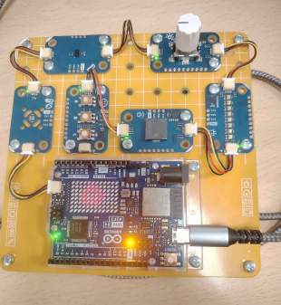
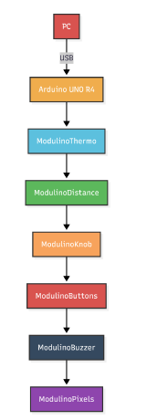
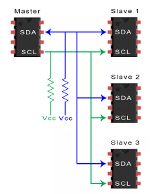

# Embedded Monitoring and Alarm System

A modular embedded monitoring system developed using **Arduino UNO R4**, **I²C communication**, and **Modulino** hardware to detect environmental hazards through temperature and proximity sensing while providing real-time visual and acoustic alerts.

---

## Contents

- Project Overview
- Features
- Technologies
- Hardware Platform
- System Architecture
- Repository Structure
- Documentation
- Project Highlights
- Learning Outcomes
- Repository Contents
- License

---

# Project Overview

This project presents the design and implementation of an embedded monitoring and alarm system capable of continuously supervising environmental conditions using multiple I²C-connected sensors.

The prototype combines embedded programming, modular hardware integration, real-time monitoring, and intelligent alarm management. Temperature and distance measurements are processed by an **Arduino UNO R4**, which controls visual and acoustic warning devices whenever predefined safety thresholds are exceeded.

<p align="center">

</p>

The project demonstrates the development of a scalable embedded system suitable for monitoring and IoT-oriented applications.

---

# Features

- Continuous ambient temperature monitoring
- Real-time proximity detection
- RGB LED bar for visual status indication
- Acoustic alarm using a digital buzzer
- Three-button physical control interface
- Adjustable operating parameters through a rotary knob
- Modular I²C daisy-chain architecture
- Embedded firmware developed in C++
- Real-time monitoring loop with low latency
- Easily extensible hardware platform

---

# Technologies

| Category | Technologies |
|-----------|--------------|
| Programming | C++ |
| Development Environment | Arduino IDE |
| Communication Protocol | I²C |
| Microcontroller | Arduino UNO R4 |
| Hardware Modules | Modulino Platform |
| Embedded Concepts | Sensors, Actuators, Real-Time Monitoring |

---

# Hardware Platform

The system is built around an **Arduino UNO R4**, which operates as the master controller of the I²C communication bus.

The prototype integrates several Modulino devices connected through a shared communication bus:

| Component | Purpose |
|-----------|---------|
| Modulino Thermo | Ambient temperature measurement |
| Modulino Distance | Proximity detection |
| Modulino Knob | Runtime parameter adjustment |
| Modulino Buttons | User interaction |
| Modulino Pixels | RGB visual alerts |
| Modulino Buzzer | Acoustic alarm generation |

---

# System Architecture

The embedded system follows a centralized **master–slave architecture** in which the Arduino UNO R4 periodically acquires sensor measurements, processes environmental conditions, and controls every actuator connected to the I²C bus.

This modular approach minimizes wiring, simplifies maintenance, and allows new peripherals to be incorporated without redesigning the hardware architecture.

<p align="center">

</p>

---

# Repository Structure

```text
embedded-monitoring-alarm-system/
│
├── docs/
│   ├── 01-project-overview.md
│   ├── 02-system-architecture.md
│   ├── 03-hardware-and-implementation.md
│   └── 04-testing-and-results.md
│
├── screenshots/
│   ├── arquitectura-fisica.png
│   ├── ejemplo-modulo.png
│   ├── esquema-bus-i2c.png
│   └── montaje-completo.png
│
├── src/
│   └── alarma_temp_proximidad_modulino.ino
│
├── README.md
└── LICENSE
```

---

# Documentation

Detailed technical documentation is available inside the **docs** directory.

| Document | Description |
|----------|-------------|
| **01 - Project Overview** | Project objectives, hardware platform, software environment, and system requirements |
| **02 - System Architecture** | Master–slave architecture, I²C communication bus, and hardware design |
| **03 - Hardware and Implementation** | Components, assembly process, hardware connections, and firmware implementation |
| **04 - Testing and Results** | Software execution, experimental validation, system performance, and conclusions |

---

# Project Highlights

## Embedded Monitoring System

Complete physical implementation of the monitoring platform based on the Arduino UNO R4 and Modulino ecosystem.

<p align="center">

</p>

---

## Modular Hardware Architecture

Master–slave organization of the embedded platform using a shared I²C communication bus.

<p align="center">

</p>

---

## I²C Communication

Shared SDA and SCL lines allow every peripheral to communicate with the Arduino UNO R4 while minimizing wiring complexity.

<p align="center">

</p>

---

# Learning Outcomes

This project provided practical experience in several areas of embedded systems engineering, including:

- Embedded programming using C++
- Arduino UNO R4 development
- Modular hardware design
- I²C communication
- Sensor integration
- Actuator control
- Real-time monitoring
- Embedded firmware development
- System validation and testing
- Design of scalable embedded architectures

---

# Repository Contents

This repository includes:

- Complete embedded firmware written in C++
- Engineering documentation
- Hardware architecture diagrams
- Assembly photographs
- I²C communication schematics
- Supporting project images

---

# License

This project is distributed under the **MIT License**.

See the **LICENSE** file for additional information.
