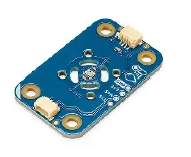

# 02 - System Architecture

## Overview

This document describes the hardware architecture of the embedded monitoring and alarm system. The project follows a modular design based on the Arduino UNO R4 platform, where sensors and actuators communicate through a shared I²C bus. This approach simplifies hardware integration, reduces wiring complexity, and allows the system to be easily extended with additional modules.

---

## Centralized Master–Slave Topology

The system is built around an **Arduino UNO R4**, which operates as the master controller of the I²C communication bus. The microcontroller is responsible for acquiring sensor measurements, processing real-time data, and controlling all output devices according to the implemented monitoring logic.

The architecture is divided into three functional layers:

- **Master Node:** Arduino UNO R4 executing the firmware and coordinating communication with every peripheral.
- **Input Modules:** Modulino Temperature Sensor, Distance Sensor, Knob, and Buttons, providing environmental measurements and user interaction.
- **Output Modules:** Modulino LED Bar and Buzzer, responsible for visual and acoustic alarm generation.

The modular organization clearly separates sensing, processing, and actuation tasks, resulting in a scalable embedded architecture suitable for monitoring applications.

---

## I²C Communication Bus

To minimize wiring and simplify hardware integration, all peripherals communicate through the **I²C protocol**.

Unlike traditional Arduino projects where each sensor occupies independent GPIO pins, the Modulino ecosystem allows multiple devices to share the same communication bus using only two signal lines:

- **SDA (Serial Data)**
- **SCL (Serial Clock)**

Each module has its own I²C address, allowing the Arduino UNO R4 to communicate with every peripheral independently without hardware conflicts.

This architecture significantly reduces cable complexity while improving scalability and maintenance.

The modules are connected using a **daisy-chain topology**, allowing new peripherals to be incorporated into the system without modifying the existing wiring.

The use of a common communication bus makes the platform highly modular and well suited for rapid prototyping of embedded systems.

---

## Hardware Platform Comparison

Several educational embedded platforms were evaluated before selecting the final architecture.

The **Modulino** ecosystem was chosen because it offers a fully integrated I²C-based design, allowing all modules to communicate through a common interface while sharing the same software library. Compared with traditional educational platforms, this considerably reduces wiring complexity and simplifies future hardware expansion.

| Feature | Modulino | Grove | BBC micro:bit |
|----------|----------|-------|----------------|
| Connection Type | I²C Bus | Analog / Digital GPIO | Analog / Digital GPIO |
| Wiring Complexity | Very Low | Medium | High |
| Scalability | High | Limited by available pins | Limited by available pins |
| Ease of Integration | Very High | High | Medium |
| Additional Electronics | Not required | Sometimes required | Usually required |
| Typical Applications | Modular embedded systems | Educational projects | Custom embedded applications |

---

## Design Decisions

Several engineering decisions guided the hardware architecture:

- Adoption of a modular master–slave design.
- Use of the I²C protocol to minimize wiring.
- Selection of the Arduino UNO R4 as the central controller.
- Separation of sensing, processing, and actuation modules.
- Modular architecture allowing future hardware expansion without redesigning the communication bus.

---

## Summary

The embedded system follows a modular architecture centered around the Arduino UNO R4 and an I²C communication bus. By combining independent sensing, processing, and actuation modules, the project achieves a scalable, maintainable, and easily extensible hardware platform while demonstrating the practical implementation of modern embedded system design principles.
